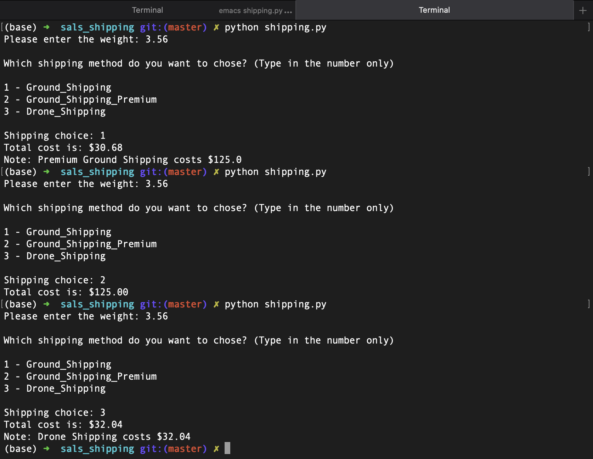

# Sal's Shipping

### What does it do ?
> Calculates shipping costs.

### How does it looks ?
> 

### How do i use it ?
> Enter the weight of your package(s).
> Choose your shipping method, and total cost will be displayed.

### How was it done ?
> Using Zsh, CLI and Emacs.

### Why ?
> Codecademy project to which i added user inputs.
